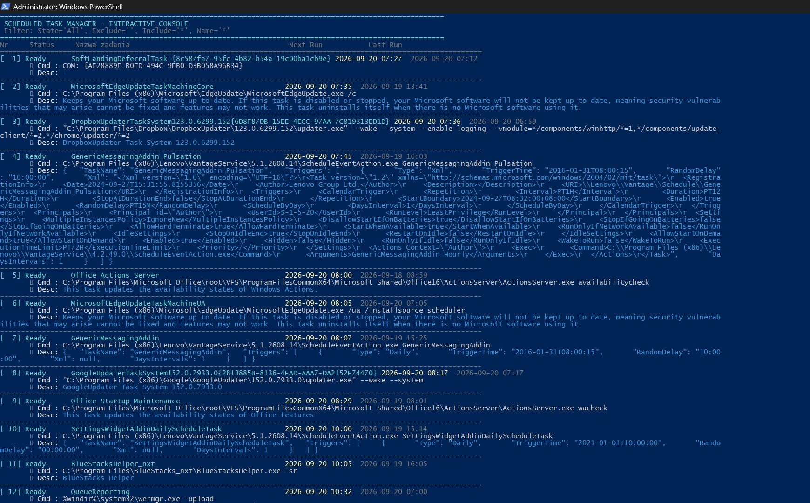
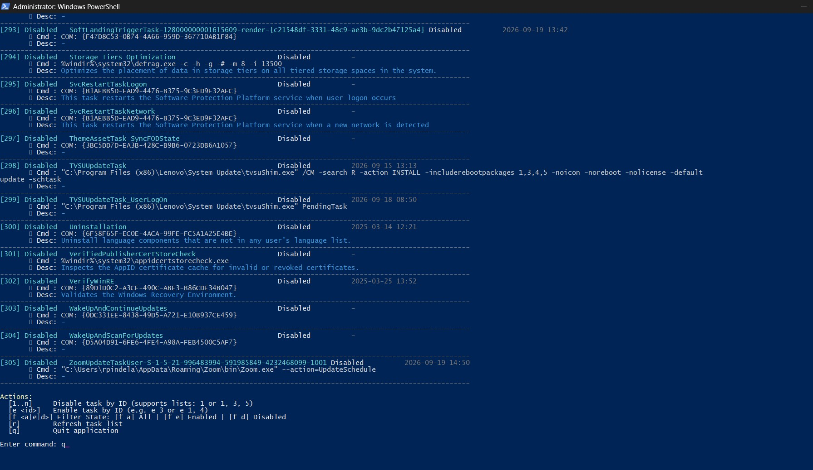

# Scheduled Task Manager (PowerShell)

A production-grade, interactive command-line utility for inspecting, disabling, and enabling Windows Scheduled Tasks. Designed for Windows Server and Windows Desktop (10/11) environments, fully compatible with both English and non-English (e.g., Polish) localized operating systems.

---

## Key Features

- **Language-Agnostic Elevation**: Validates administrative privileges via the built-in Well-Known SID (`S-1-5-32-544`), avoiding localization issues between English (`Administrators`) and Polish (`Administratorzy`) systems.
- **Automatic UAC Elevation**: Detects unelevated shells and relaunches the script in an elevated context, preserving all provided parameters.
- **Safe CLI & Input Sanitization**: Robust CLI loop parsing numeric identifiers, rejecting unexpected tokens, and preventing accidental task modifications.
- **Non-Microsoft Task Focus**: Defaults to excluding native `*Microsoft*` tasks so operators can inspect third-party services and custom automated scripts without system clutter.
- **Batch Processing**: Supports toggling multiple tasks simultaneously using comma-separated or space-separated ID lists.
- **Zero-Parameter Safety**: Running the script without parameters outputs the help guide and parameter syntax rather than executing modifications.

---

## Author & Version

- **Version**: `1.2.0`
- **Author**: Roman Pindela
- **Email**: [roman.pindela@gmail.com](mailto:roman.pindela@gmail.com)
- **GitHub**: [https://github.com/romanpindela](https://github.com/romanpindela)

---

## Installation & Security Prerequisites

### 1. Unblocking the Script
When downloading PowerShell scripts directly from GitHub, Windows tags them with the `Zone.Identifier` stream (Mark of the Web). Remove this protection before execution:

```powershell
Unblock-File -Path ".\manage-scheduled-tasks.ps1"
```

2. Execution Policy on Windows ServerIf your Windows Server or workstation enforces RemoteSigned or Restricted execution policies, run the script by bypassing the execution policy for the current scope or process:PowerShellpowershell.exe -ExecutionPolicy Bypass -File .\manage-scheduled-tasks.ps1 -Interactive
Or set the execution scope in your current PowerShell session:PowerShellSet-ExecutionPolicy -Scope Process -ExecutionPolicy Bypass -Force
.\manage-scheduled-tasks.ps1 -Interactive
Syntax and ParametersPowerShell.\manage-scheduled-tasks.ps1 [-Interactive | -i]
                            [-ListOnly | -l]
                            [-ExcludePathPattern <string>]
                            [-IncludePathPattern <string>]
                            [-NamePattern <string>]
                            [-Help | -h]
Parameters ReferenceParameterAliasTypeDefaultDescription-Interactive-iSwitchFalseLaunches the interactive management menu in the console.-ListOnly-lSwitchFalseLists matching scheduled tasks and metadata, then immediately exits.-ExcludePathPatternString*Microsoft*Wildcard filter specifying task paths to exclude. Set to "" to show all.-IncludePathPatternString*Wildcard filter specifying task paths to include.-NamePatternString*Wildcard pattern to match against task names.-Help-hSwitchFalseDisplays the help menu, syntax reference, and version info.Usage Examples1. Interactive Task ManagementLaunch the console interface with default exclusions (*Microsoft* hidden):PowerShell.\manage-scheduled-tasks.ps1 -Interactive
2. List Tasks Non-InteractivelyQuery and inspect all backup-related tasks:PowerShell.\manage-scheduled-tasks.ps1 -ListOnly -NamePattern "*Backup*"
3. Inspect System TasksClear the exclusion mask to list all scheduled tasks, including native Microsoft components:PowerShell.\manage-scheduled-tasks.ps1 -ListOnly -ExcludePathPattern ""
4. Display Help ScreenPowerShell.\manage-scheduled-tasks.ps1 -Help
Interactive Console ControlsWhen operating inside -Interactive mode, use the following commands:CommandActionExample<ID>Disables a single task by its list ID2<ID1>, <ID2>, ...Disables multiple tasks in a batch1, 3, 5e <ID>Re-enables a task by its IDe 2e <ID1>, <ID2>Re-enables multiple tasks in a batche 1, 4rRefreshes the task list and execution statesrqExits the interactive manager safelyq

### Interactive Run - Listed Tasks


### Interactive Run - Menu 
