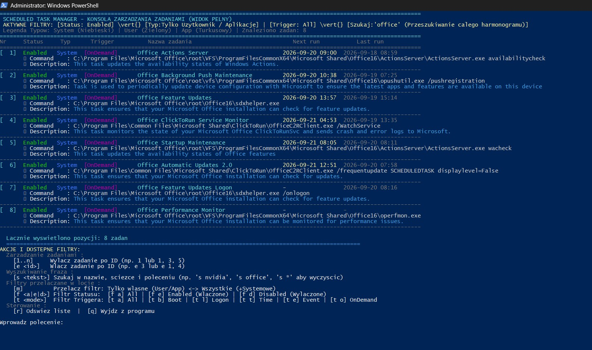
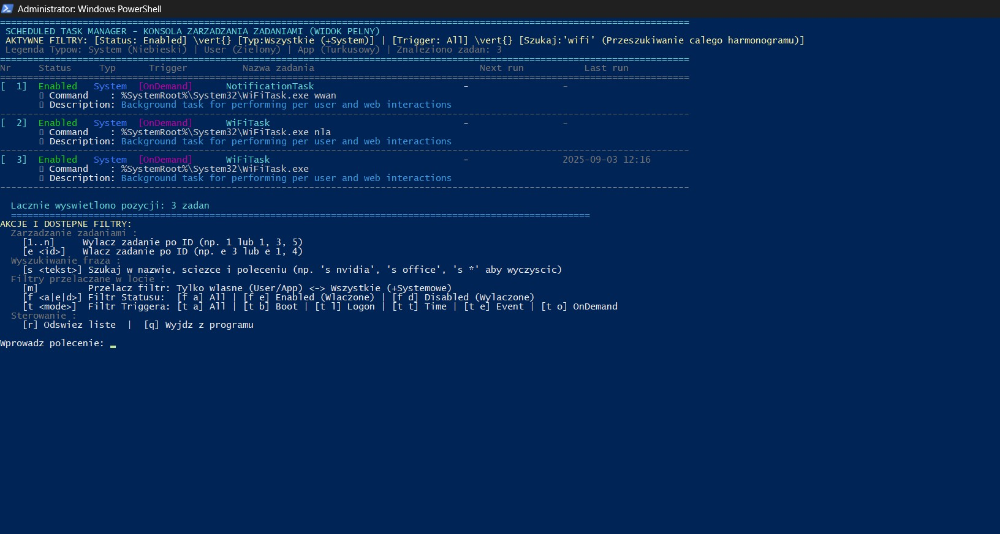

# Windows Scheduled Task Manager (`manage-scheduled-tasks.ps1`)

[](https://microsoft.com/powershell)
[](https://www.microsoft.com/windows)
[](https://github.com/romanpindela)
[](mailto:roman.pindela@gmail.com)

A robust, interactive CLI management tool for Windows Scheduled Tasks. Designed for system administrators, engineers, and power users, this tool provides full visibility into scheduled tasks, execution details, action commands, triggers, and state management across Windows Desktop and Windows Server environments.

---

## 🌟 Key Features

- **Full-Width Multi-Line Layout**:
  - **Line 1**: `Nr` | `Status` (`Enabled`/`Disabled`) | `Typ` (`System`/`User`/`App`) | `Trigger` | `Task Name` | `Next run` | `Last run`
  - **Line 2**: Complete binary executable path and CLI arguments (`↳ Command    : ...`)
  - **Line 3**: Sanitized task description (`↳ Description: ...`)
  - **Line 4**: Visual horizontal separator line
- **Targeted Batch Name Control (`-DisableByName` / `-EnableByName`)**:
  - Enable or disable tasks across the entire Task Scheduler hierarchy directly by name or wildcard pattern (e.g. `*Printer*`, `*Edge*`, `Lenovo*`), eliminating manual path navigation.
  - Available both via direct CLI execution (headless/automation) and inside the interactive console (`d <pattern>` / `en <pattern>`).
- **Universal Substring Search (`s <phrase>`)**:
  - Searches task names, task paths, and executable action commands in real-time.
  - Automatically bypasses system path exclusion during active queries (e.g., `s office`, `s nvidia`, `s edge`, `s update`).
  - Clear with `s *` or `s`.
- **Accurate Trigger Parsing**:
  - Automatically extracts and formats CIM/WMI triggers into clean tags: `[Boot]`, `[Logon]`, `[Daily@HH:mm]`, `[Weekly(Days)@HH:mm]`, `[Monthly@HH:mm]`, `[Once@HH:mm]`, `[Event]`, `[Idle]`, `[Session]`, or `[OnDemand]`.
- **Chronological Sorting**:
  - Tasks are ordered chronologically by `Next Run` ascending (nearest execution first). Disabled or unscheduled tasks are neatly organized at the bottom.
- **Task Categorization & Color Palette (ANSI VT100)**:
  - `System` (Blue) — Built-in Windows & Microsoft services.
  - `User` (Green) — User-profile tasks and user SID contexts (`S-1-5-21-...`).
  - `App` (Cyan) — Third-party software (Nvidia, Adobe, Google, browsers, etc.).
- **Safe Execution & Language Agnostic Elevation**:
  - Uses language-independent Well-Known SID checking (`S-1-5-32-544`) to guarantee Administrator privileges on localized Windows editions (Polish, English, German, etc.), prompting for automatic UAC elevation if required.
  - Hashtable splatting parameter calls eliminate PowerShell CLI concatenation/whitespace parsing bugs.

---

## 📋 System Requirements

- **Operating System**: Windows 10, Windows 11, Windows Server 2016 / 2019 / 2022 / 2025.
- **PowerShell**: Windows PowerShell 5.1 or PowerShell Core (7.x+).
- **Privileges**: Elevated Administrator privileges (script auto-elevates if executed standard).

---

## 🚀 Quick Start

### 1. Interactive Console Mode (Default)
Run the script interactively to inspect, filter, search, enable, and disable tasks on the fly:

```powershell
powershell.exe -ExecutionPolicy Bypass -File .\manage-scheduled-tasks.ps1 -Interactive
```
2. Direct Task Toggling by Name / Wildcard (Non-Interactive)Enable or disable tasks across all folders and subfolders by name or wildcard pattern without entering the interactive shell:PowerShell# Disable tasks matching a pattern across all task folders
.\manage-scheduled-tasks.ps1 -DisableByName '*Printer Health Monitor*'

# Disable third-party update tasks using wildcards
.\manage-scheduled-tasks.ps1 -DisableByName '*EdgeUpdate*'

# Enable tasks matching a specific pattern
.\manage-scheduled-tasks.ps1 -EnableByName 'Printer Health Monitor'
3. Command-Line / Non-Interactive Inspection Mode (-ListOnly)Display scheduled tasks directly to standard output and exit:PowerShell# List only Enabled non-Microsoft tasks (default view)
.\manage-scheduled-tasks.ps1 -ListOnly

# List all Disabled tasks
.\manage-scheduled-tasks.ps1 -ListOnly -StateFilter Disabled

# List only Logon-triggered tasks
.\manage-scheduled-tasks.ps1 -ListOnly -TriggerFilter Logon

# List all tasks including system tasks
.\manage-scheduled-tasks.ps1 -ListOnly -ExcludePathPattern "" -StateFilter All


### Interactive run - Filtered Tasks


### Interactive run - Filtered Tasks - System Tasks


### Enable and Disable tasks by name
